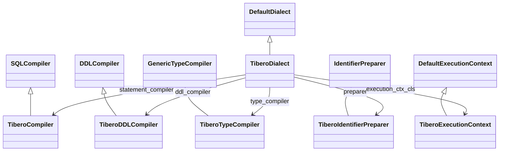

# API Reference

This reference documents the public API surface in `sqlalchemy_pytibero`.

## Dialect class

## `TiberoDialect`

Module: `sqlalchemy_pytibero.dialect`

### Key class attributes

| Attribute | Value |
|---|---|
| `name` | `"tibero"` |
| `driver` | `"pytibero"` |
| `default_paramstyle` | `"qmark"` |
| `statement_compiler` | `TiberoCompiler` |
| `ddl_compiler` | `TiberoDDLCompiler` |
| `type_compiler` | `TiberoTypeCompiler` |
| `preparer` | `TiberoIdentifierPreparer` |
| `execution_ctx_cls` | `TiberoExecutionContext` |

### Public methods

| Method | Purpose |
|---|---|
| `import_dbapi()` | Imports and returns `pytibero`. |
| `dbapi()` | Alias to `import_dbapi()`. |
| `create_connect_args(url)` | Builds DB-API connection kwargs with Tibero defaults. |
| `on_connect()` | Returns a connection initializer (`autocommit=False`, optional isolation). |
| `get_isolation_level(dbapi_conn)` | Reads current session isolation via `SYS_CONTEXT`. |
| `get_isolation_level_values()` | Returns supported values: `READ COMMITTED`, `SERIALIZABLE`. |
| `set_isolation_level(dbapi_conn, level)` | Applies isolation level with validation. |
| `reset_isolation_level(dbapi_conn)` | Resets to `READ COMMITTED`. |
| `_get_server_version_info(connection)` | Parses version tuple from `V$VERSION`. |
| `_get_default_schema_name(connection)` | Returns current schema from `SYS_CONTEXT`. |
| `get_table_names(...)` | Reflects table names. |
| `get_view_names(...)` | Reflects view names. |
| `get_view_definition(...)` | Reflects a view definition. |
| `get_columns(...)` | Reflects table columns and resolved types. |
| `get_pk_constraint(...)` | Reflects primary key metadata. |
| `get_foreign_keys(...)` | Reflects foreign keys. |
| `get_indexes(...)` | Reflects indexes. |
| `get_unique_constraints(...)` | Reflects unique constraints. |
| `get_check_constraints(...)` | Reflects check constraints. |
| `get_table_comment(...)` | Reflects table comment. |
| `get_schema_names(connection, **kw)` | Returns schema usernames. |
| `has_table(...)` | Checks table or view existence. |
| `has_index(...)` | Checks index existence. |
| `has_sequence(...)` | Checks sequence existence. |
| `is_disconnect(e, connection, cursor)` | Heuristic disconnect detection. |
| `do_ping(dbapi_connection)` | Executes `SELECT 1 FROM DUAL` health check. |

### Key method parameters

#### `create_connect_args(url)`

| Parameter | Type | Notes |
|---|---|---|
| `url` | SQLAlchemy URL | Required. Raises `ValueError` when `None`. |

#### `set_isolation_level(dbapi_conn, level)`

| Parameter | Type | Notes |
|---|---|---|
| `dbapi_conn` | DB-API connection | Must provide `cursor()`. |
| `level` | `str` | Case-insensitive input; must normalize to supported values. |

## SQL compiler classes

## `TiberoCompiler`

Module: `sqlalchemy_pytibero.compiler`

Important visit/override methods:

- `visit_sysdate_func()` -> `SYSDATE`
- `visit_systimestamp_func()` -> `SYSTIMESTAMP`
- `visit_dual_func()` -> `DUAL`
- `visit_nvl_func()` -> `NVL(...)`
- `default_from()` -> ` FROM DUAL`
- `visit_cast()`
- `render_literal_value()` (escapes backslashes)
- `get_select_precolumns()`
- `visit_join()`
- `for_update_clause()`
- `limit_clause()` (`OFFSET`/`FETCH FIRST`)

## `TiberoDDLCompiler`

Important methods:

- `get_column_specification()`
- `post_create_table()`
- `visit_set_table_comment()`
- `visit_drop_table_comment()`
- `visit_set_column_comment()`

## `TiberoTypeCompiler`

Supports Tibero-oriented type rendering methods, including:

- Numeric: `visit_NUMERIC`, `visit_NUMBER`, `visit_DECIMAL`, `visit_FLOAT`
- Float variants: `visit_BINARY_FLOAT`, `visit_BINARY_DOUBLE`
- Integer: `visit_SMALLINT`, `visit_INTEGER`, `visit_BIGINT`
- Character/Large text: `visit_VARCHAR2`, `visit_CHAR`, `visit_NCHAR`, `visit_NVARCHAR2`, `visit_CLOB`, `visit_NCLOB`, `visit_LONG`
- Binary: `visit_BLOB`, `visit_RAW`, `visit_LONG_RAW`
- Date/time/interval: `visit_DATE`, `visit_TIMESTAMP`, `visit_INTERVAL_YEAR_TO_MONTH`, `visit_INTERVAL_DAY_TO_SECOND`
- Generic coercions: `visit_BOOLEAN`, `visit_large_binary`, `visit_text`, `visit_datetime`

## Base classes

## `TiberoIdentifierPreparer`

Module: `sqlalchemy_pytibero.base`

- Uses Tibero reserved words set for quoting decisions.
- Provides `_quote_free_identifiers(*ids)` helper.

## `TiberoExecutionContext`

Module: `sqlalchemy_pytibero.base`

- `should_autocommit_text(statement)` checks DML/DDL patterns.
- `get_lastrowid()` returns `cursor.lastrowid` when available, otherwise `None`.

## Type classes (`sqlalchemy_pytibero.types`)

- `NUMBER`, `NUMERIC`, `DECIMAL`, `FLOAT`, `BINARY_FLOAT`, `BINARY_DOUBLE`
- `SMALLINT`, `INTEGER`, `BIGINT`
- `VARCHAR2`, `CHAR`, `NCHAR`, `NVARCHAR2`
- `CLOB`, `NCLOB`, `BLOB`
- `DATE`, `TIMESTAMP`
- `INTERVAL_YEAR_TO_MONTH`, `INTERVAL_DAY_TO_SECOND`
- `RAW`, `LONG_RAW`, `LONG`, `ROWID`

## Class hierarchy overview

!!! note "Version"
    Current package version in `__init__.py` is `0.1.0`.
