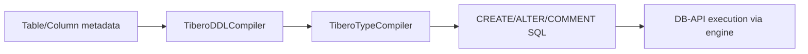

# DDL Generation

DDL generation is handled by `TiberoDDLCompiler` and `TiberoTypeCompiler`.

## CREATE TABLE column specification

`TiberoDDLCompiler.get_column_specification()` builds each column as:

1. Formatted column name
2. Compiled Tibero type
3. `NOT NULL` when applicable
4. Identity or default clause

Identity behavior:

- If column is the table autoincrement column and has no server default, emit:

```sql
GENERATED ALWAYS AS IDENTITY
```

- Otherwise, emit explicit `DEFAULT <expr>` if present.

## Table comments

Supported comment methods:

- `post_create_table(table)` appends `COMMENT ON TABLE ...`
- `visit_set_table_comment(create, **kw)`
- `visit_drop_table_comment(drop, **kw)`

Example emitted SQL:

```sql
COMMENT ON TABLE users IS 'Application users'
```

## Column comments

`visit_set_column_comment(create, **kw)` emits:

```sql
COMMENT ON COLUMN users.name IS 'Display name'
```

## Sequences

The dialect advertises `supports_sequences = True` and `sequences_optional = True`, so SQLAlchemy sequence constructs are supported.

## DDL compilation flow



!!! note "Comments are emitted separately"
    `inline_comments = False`, so comments are produced as standalone `COMMENT ON` statements.

!!! warning "Identity condition is strict"
    Identity SQL is only emitted for SQLAlchemy's detected autoincrement column with no explicit server default.
