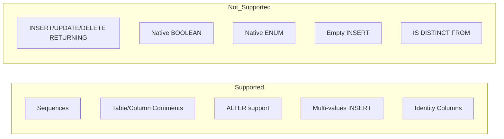

# Dialect Features

This page summarizes capability flags and SQL behaviors implemented by `TiberoDialect`, `TiberoCompiler`, and `TiberoDDLCompiler`.

## Core capability flags

| Feature | Value |
|---|---|
| `supports_statement_cache` | `True` |
| `supports_sequences` | `True` |
| `sequences_optional` | `True` |
| `supports_comments` | `True` |
| `inline_comments` | `False` |
| `supports_alter` | `True` |
| `supports_native_decimal` | `True` |
| `supports_native_boolean` | `False` |
| `supports_native_enum` | `False` |
| `supports_default_values` | `False` |
| `supports_default_metavalue` | `False` |
| `supports_empty_insert` | `False` |
| `supports_multivalues_insert` | `True` |
| `supports_is_distinct_from` | `False` |
| `insert_returning` | `False` |
| `update_returning` | `False` |
| `delete_returning` | `False` |

## Isolation levels

Supported values from `get_isolation_level_values()`:

- `READ COMMITTED`
- `SERIALIZABLE`

`on_connect()` sets `conn.autocommit = False` and applies configured isolation level when provided.

## Identity columns

`TiberoDDLCompiler.get_column_specification()` emits identity syntax for SQLAlchemy autoincrement primary-key columns without explicit server default:

```sql
GENERATED ALWAYS AS IDENTITY
```

## LIMIT/OFFSET

`TiberoCompiler.limit_clause()` uses ANSI-style pagination:

- offset only: `OFFSET <n> ROWS`
- limit only: `FETCH FIRST <n> ROWS ONLY`
- both: `OFFSET <n> ROWS FETCH FIRST <m> ROWS ONLY`

## Feature matrix



!!! warning "No RETURNING support"
    ORM patterns that depend on SQL `RETURNING` need alternatives (follow-up `SELECT`, sequence usage, or relying on DB-API `lastrowid` when available).

!!! note "BOOLEAN handling"
    `TiberoTypeCompiler.visit_BOOLEAN()` compiles to `NUMBER(1)`.

!!! tip "Comments are out-of-line"
    Comments are emitted via separate `COMMENT ON ...` statements because `inline_comments` is disabled.
