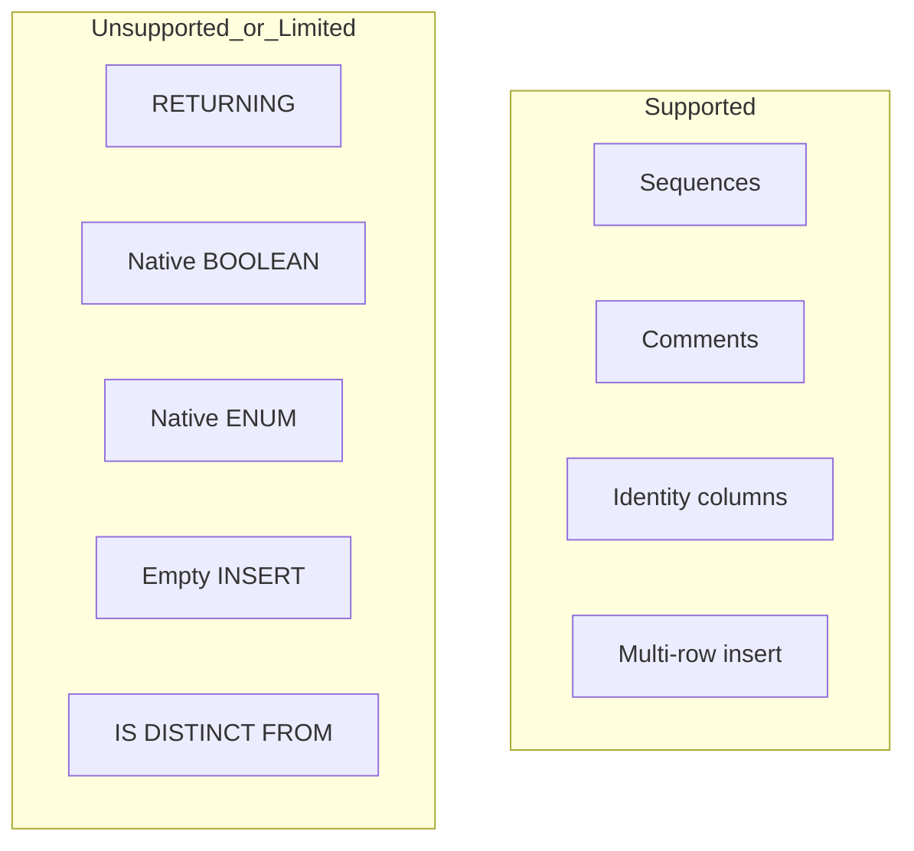

# Limitations and Workarounds

This page lists currently declared limitations in `TiberoDialect` and compiler behavior.

## SQL RETURNING is disabled

Dialect flags:

- `insert_returning = False`
- `update_returning = False`
- `delete_returning = False`

Workarounds:

- Execute DML, then query the changed row(s) with a follow-up `SELECT`.
- For generated identifiers, rely on sequence usage or DB-API `lastrowid` when available.

## No native BOOLEAN type

- `supports_native_boolean = False`
- `BOOLEAN` compiles to `NUMBER(1)`.

Workarounds:

- Store booleans as `0/1` (`NUMBER(1)`).
- Add check constraints such as `CHECK (flag IN (0, 1))`.

## No native ENUM type

- `supports_native_enum = False`

Workarounds:

- Use `String`/`VARCHAR2` with an explicit check constraint.
- Enforce allowed values in application logic.

## Empty INSERT unsupported

- `supports_empty_insert = False`

Workarounds:

- Always provide at least one explicit column/value in INSERT statements.
- Use server defaults with explicit column lists where possible.

## SQL feature gaps declared by flags

- `supports_default_values = False`
- `supports_default_metavalue = False`
- `supports_is_distinct_from = False`

Workarounds:

- Prefer explicit values/default expressions.
- Replace `IS DISTINCT FROM` logic with equivalent null-safe predicates.

## Reflection caveat for unknown types

Unknown reflected column types map to `sqltypes.NULLTYPE`.

Workaround:

- Add/extend `ischema_names` mapping in the dialect when introducing new Tibero data types.

## Supported vs unsupported overview

!!! warning "Model with constraints"
    Because native boolean/enum support is disabled, schema-level constraints are important for data integrity.
