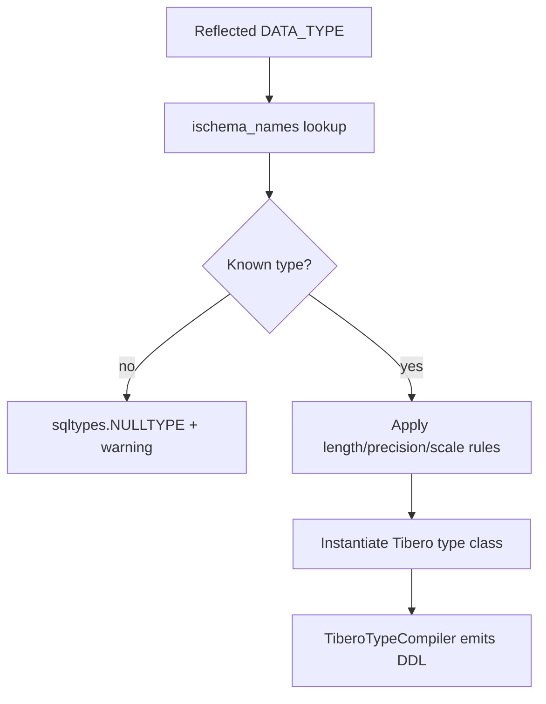

# Type Mapping

`sqlalchemy-pytibero` provides Tibero-specific type classes and compilers for DDL generation and reflection.

## Exported Tibero type classes

- `NUMBER`
- `NUMERIC`
- `DECIMAL`
- `FLOAT`
- `BINARY_FLOAT`
- `BINARY_DOUBLE`
- `SMALLINT`
- `INTEGER`
- `BIGINT`
- `VARCHAR2`
- `CHAR`
- `NCHAR`
- `NVARCHAR2`
- `CLOB`
- `BLOB`
- `NCLOB`
- `DATE`
- `TIMESTAMP`
- `INTERVAL_YEAR_TO_MONTH`
- `INTERVAL_DAY_TO_SECOND`
- `RAW`
- `LONG_RAW`
- `LONG`
- `ROWID`

## Reflection mapping (`ischema_names`)

The dialect maps reflected Tibero type names to SQLAlchemy type classes:

| Reflected Tibero type | Mapped class |
|---|---|
| NUMBER | `NUMBER` |
| NUMERIC | `NUMERIC` |
| DECIMAL | `DECIMAL` |
| FLOAT | `FLOAT` |
| BINARY_FLOAT | `BINARY_FLOAT` |
| BINARY_DOUBLE | `BINARY_DOUBLE` |
| SMALLINT | `SMALLINT` |
| INTEGER | `INTEGER` |
| INT | `INTEGER` |
| BIGINT | `BIGINT` |
| VARCHAR2 | `VARCHAR2` |
| VARCHAR | `VARCHAR2` |
| CHAR | `CHAR` |
| NCHAR | `NCHAR` |
| NVARCHAR2 | `NVARCHAR2` |
| CLOB | `CLOB` |
| NCLOB | `NCLOB` |
| BLOB | `BLOB` |
| DATE | `DATE` |
| TIMESTAMP | `TIMESTAMP` |
| TIMESTAMP WITH TIME ZONE | `TIMESTAMP` |
| TIMESTAMP WITH LOCAL TIME ZONE | `TIMESTAMP` |
| RAW | `RAW` |
| LONG RAW | `LONG_RAW` |
| LONG | `LONG` |
| LONG VARCHAR | `LONG` |
| ROWID | `ROWID` |
| INTERVAL YEAR TO MONTH | `INTERVAL_YEAR_TO_MONTH` |
| INTERVAL DAY TO SECOND | `INTERVAL_DAY_TO_SECOND` |

## Type compiler behavior (`TiberoTypeCompiler`)

Selected compilation rules:

- `BOOLEAN` -> `NUMBER(1)`
- `BIGINT` -> `NUMBER(19)`
- `VARCHAR` -> `VARCHAR2`
- `NVARCHAR` -> `NVARCHAR2`
- `LargeBinary` -> `BLOB`
- `Text` -> `CLOB`
- `DateTime` -> `DATE`

## Tibero to SQLAlchemy to Python mapping

| Tibero Type | SQLAlchemy Type Class | Typical Python Type |
|---|---|---|
| NUMBER(p,s) | `NUMBER` / `NUMERIC` / `DECIMAL` | `decimal.Decimal` |
| FLOAT / BINARY_FLOAT / BINARY_DOUBLE | `FLOAT` / `BINARY_FLOAT` / `BINARY_DOUBLE` | `float` |
| SMALLINT / INTEGER / BIGINT | `SMALLINT` / `INTEGER` / `BIGINT` | `int` |
| VARCHAR2 / CHAR / NCHAR / NVARCHAR2 | `VARCHAR2` / `CHAR` / `NCHAR` / `NVARCHAR2` | `str` |
| CLOB / LONG | `CLOB` / `LONG` | `str` |
| NCLOB | `NCLOB` | `str` |
| BLOB / RAW / LONG RAW | `BLOB` / `RAW` / `LONG_RAW` | `bytes` |
| DATE / TIMESTAMP | `DATE` / `TIMESTAMP` | `datetime.date` / `datetime.datetime` |
| INTERVAL YEAR TO MONTH | `INTERVAL_YEAR_TO_MONTH` | driver-dependent |
| INTERVAL DAY TO SECOND | `INTERVAL_DAY_TO_SECOND` | driver-dependent |
| ROWID | `ROWID` | driver-dependent |

## Resolution flow

!!! warning "Unknown reflected types"
    `_resolve_column_type()` emits `sqltypes.NULLTYPE` and a warning for unknown type names.

!!! note "National character types"
    `NCHAR` and `NVARCHAR2` set `national=True` in constructors.

!!! tip "RAW length"
    `RAW(length=...)` preserves explicit byte length and compiles as `RAW(<length>)`.
